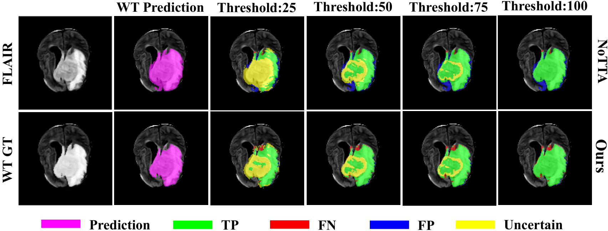

# 🧠 SmaRT: Style-Modulated Robust Test-Time Adaptation

We propose a test-time adaptation method called **SmaRT (Style-Modulated Robust Test-Time Adaptation)**.  
This method is designed for **source-free cross-domain brain tumor segmentation** in MRI.  
The main contributions of this work can be summarized as follows:

- **Style-aware augmentation**: dynamically generates diverse domain-specific appearances to alleviate scanner/protocol variations.  
- **Dual-EMA pseudo-label refinement**: employs two teacher models with adaptive momentum, improving stability and reliability.  
- **Structural priors**: incorporates consistency, integrity, and connectivity constraints to preserve tumor anatomy.  
- **Comprehensive validation**: extensive experiments on **BraTS-SSA** and **BraTS-PED** datasets demonstrate superior segmentation accuracy and robustness compared to state-of-the-art SFUDA methods.

# 💡 Proposed method
Overview of the proposed SmaRT framework. A dual-branch design with style modulation and multi-head structural constraints enables stable test-time adaptation and preserves anatomical fidelity.


Dynamic composite data augmentation. Eleven candidate combinations from eight operations are adaptively weighted to generate diverse augmented views for robust target-domain adaptation.


# ⚡ Visual Comparison
Comparative visualization on the BraTS-SSA dataset. SmaRT achieves clearer tumor boundaries and fewer false predictions than competing adaptation methods, demonstrating superior cross-domain robustness. 


Ablation visualization on the BraTS-SSA dataset. Without structural heads or style/augmentation modules, predictions become fragmented, whereas the full model yields coherent and stable segmentations.


Confidence calibration. Predicted probability distributions show that SmaRT yields better-calibrated outputs, improving reliability of pseudo-labels.


Uncertainty-guided refinement. SmaRT produces stable tumor boundaries across thresholds, reducing false positives and negatives compared with the NoTTA baseline.



## 🔧 Environment Setup
Please prepare an environment with Python 3.8, and then install the dependencies:

```bash
conda create -n SmaRT python=3.8
conda activate SmaRT
pip install -r requirements.txt
```

## 🏋️ Pre-train on Source Domain (BraTS 2024)
Run train_source.py to obtain pre-trained weights:

```bash
python train_source.py
```
## 🧪 Test-Time Adaptation in Target Domain (BraTS-SSA/PED)
>⚠️ Note: Before running test.py, please check the parameter settings in the config file and update the weight path to the pre-trained checkpoint.

Run test.py to adapt and evaluate on the target domain:

```bash
python test.py
```

## 🚀 Results
Comparison of SmaRT with other state-of-the-art models on the BraTS-SSA Dataset:

| Metric      | Region | NoTTA | STDR | DANN | RSA | Tent | SaTTCA | DGTTA | SFDA-FSM | Ours |
|-------------|--------|-------|------|------|-----|------|--------|-------|----------|------|
| **Dice**    | ET     | 0.5232 | 0.5483 | 0.5394 | 0.5527 | *0.6145* | 0.5929 | 0.5995 | 0.6118 | **0.6358** |
|             | TC     | 0.5153 | 0.5784 | 0.5534 | 0.5616 | *0.6010* | 0.5791 | 0.5839 | 0.5936 | **0.6251** |
|             | WT     | 0.7468 | 0.7505 | 0.7506 | *0.7593* | 0.7415 | 0.7195 | 0.7384 | 0.6761 | **0.7909** |
| **HD95**    | ET     | 26.85  | 15.18  | 12.66  | 17.66  | *5.49*  | 7.35   | 6.98   | 18.39  | **4.80** |
|             | TC     | 27.04  | 14.88  | 12.50  | 17.68  | *5.77*  | 7.60   | 7.38   | 16.82  | **4.93** |
|             | WT     | 15.22  | 12.29  | 14.20  | 15.80  | *2.79*  | 4.48   | 3.94   | 12.27  | **2.61** |
| **IoU**     | ET     | 0.3847 | 0.4202 | 0.4078 | 0.4207 | 0.4732  | 0.4564 | 0.4621 | *0.4789* | **0.4907** |
|             | TC     | 0.3913 | 0.4648 | 0.4344 | 0.4423 | 0.4323  | 0.4305 | 0.4320 | *0.4746* | **0.4974** |
|             | WT     | 0.6409 | 0.6533 | 0.6399 | 0.6514 | *0.6583* | 0.6157 | 0.6397 | 0.5482 | **0.6731** |
| **Sensitivity** | ET | 0.6328 | 0.6202 | 0.6587 | 0.6585 | 0.6381  | 0.6397 | 0.6375 | *0.6671* | **0.6757** |
|             | TC     | 0.6302 | 0.6355 | *0.6577* | 0.6559 | 0.6148 | 0.6212 | 0.6183 | 0.6553 | **0.6694** |
|             | WT     | 0.6771 | 0.6604 | 0.6827 | 0.6826 | *0.6883* | 0.6828 | 0.6831 | 0.6791 | **0.6885** |

Comparison of SmaRT with other state-of-the-art models on the BraTS-PED dataset:

| Metric      | Region | NoTTA | STDR | DANN | RSA | Tent | SaTTCA | DGTTA | SFDA-FSM | Ours |
|-------------|--------|-------|------|------|-----|------|--------|-------|----------|------|
| **Dice**    | ET     | 0.4232 | 0.4304 | *0.4582* | 0.4479 | 0.4086 | 0.4115 | 0.4232 | 0.4302 | **0.5358** |
|             | TC     | 0.2316 | 0.2642 | 0.2615  | 0.2512 | 0.2610 | 0.2755 | 0.2535 | *0.2851* | **0.3639** |
|             | WT     | 0.5549 | 0.5713 | 0.5687  | 0.5614 | 0.5775 | 0.5482 | *0.5837* | 0.4748 | **0.7265** |
| **HD95**    | ET     | *8.69* | 15.42  | 15.46   | 16.34  | 10.11  | 12.19  | 9.85    | 20.27  | **8.66** |
|             | TC     | 14.33  | 12.23  | 12.26   | 16.58  | 12.59  | *11.74* | 12.65  | 32.68  | **10.78** |
|             | WT     | *8.40* | 13.43  | 13.46   | 14.74  | 13.50  | 15.75  | 12.60  | 21.92  | **8.31** |
| **IoU**     | ET     | 0.4381 | 0.3462 | 0.3794  | 0.3791 | 0.4323 | 0.4059 | *0.4400* | 0.3418 | **0.5183** |
|             | TC     | 0.1742 | 0.2007 | 0.2062  | 0.2015 | 0.2009 | *0.2106* | 0.1934 | 0.2071 | **0.2672** |
|             | WT     | *0.4944* | 0.4493 | 0.4531 | 0.4287 | 0.4594 | 0.4107 | 0.4744 | 0.3514 | **0.6019** |
| **Sensitivity** | ET | 0.6242 | 0.6554 | 0.6497  | 0.6583 | 0.6464 | 0.6502 | 0.6437 | *0.6747* | **0.6925** |
|             | TC     | 0.5410 | 0.5493 | *0.5736* | 0.5715 | 0.5486 | 0.5521 | 0.5464 | 0.5534 | **0.6137** |
|             | WT     | 0.6341 | 0.6359 | 0.6621  | 0.6548 | 0.6686 | *0.6761* | 0.6620 | 0.6465 | **0.7082** |


Ablation study results of our proposed SmaRT on the BraTS-SSA dataset:

| Metric      | Region | w/o Consistency | w/o Integrity | w/o Connectivity | w/o Data Aug. | w/o Style Mod. | SmaRT |
|-------------|--------|-----------------|---------------|------------------|---------------|----------------|-------|
| **Dice**    | ET     | 0.5805          | 0.5597        | 0.5614           | 0.5814        | *0.6013*       | **0.6358** |
|             | TC     | 0.5414          | 0.5209        | 0.5228           | 0.5429        | *0.5879*       | **0.6251** |
|             | WT     | 0.7231          | 0.6994        | 0.7038           | *0.7255*      | 0.6283         | **0.7909** |
| **HD95**    | ET     | 37.07           | 38.38         | 38.35            | 37.08         | *21.08*        | **4.80** |
|             | TC     | 37.44           | 44.96         | 38.71            | 37.43         | *20.62*        | **4.93** |
|             | WT     | 6.85            | 13.85         | 7.58             | *6.81*        | 14.02          | **2.61** |
| **IoU**     | ET     | 0.4615          | 0.4423        | 0.4440           | 0.4624        | *0.4871*       | **0.4907** |
|             | TC     | 0.4352          | 0.4161        | 0.4178           | 0.4367        | *0.4891*       | **0.4974** |
|             | WT     | 0.6086          | 0.5829        | 0.5876           | *0.6111*      | 0.5290         | **0.6731** |
| **Sensitivity** | ET | 0.6240          | 0.6188        | 0.6192           | 0.6246        | *0.6516*       | **0.6757** |
|             | TC     | 0.6133          | 0.6081        | 0.6086           | 0.6140        | *0.6443*       | **0.6694** |
|             | WT     | 0.6608          | 0.6512        | 0.6527           | *0.6616*      | 0.6405         | **0.6885** |

Ablation study results of our proposed SmaRT on the BraTS-PED dataset:

| Metric      | Region | w/o Consistency | w/o Integrity | w/o Connectivity | w/o Data Aug. | w/o Style Mod. | SmaRT |
|-------------|--------|-----------------|---------------|------------------|---------------|----------------|-------|
| **Dice**    | ET     | 0.4697          | 0.4584        | 0.4685           | *0.4723*      | 0.4119         | **0.6600** |
|             | TC     | 0.2863          | 0.2862        | 0.2874           | 0.2958        | *0.3190*       | **0.4435** |
|             | WT     | 0.5941          | 0.6135        | *0.6372*         | 0.6008        | 0.5644         | **0.7675** |
| **HD95**    | ET     | 41.37           | 41.14         | 40.62            | *37.52*       | 42.03          | **7.94** |
|             | TC     | 68.84           | 69.00         | 68.45            | 65.04         | *53.13*        | **10.20** |
|             | WT     | 11.68           | *10.75*       | 12.80            | 11.03         | 14.03          | **7.31** |
| **IoU**     | ET     | 0.3886          | 0.3778        | 0.3847           | *0.3902*      | 0.3323         | **0.5233** |
|             | TC     | 0.2098          | 0.2094        | 0.2100           | 0.2162        | *0.2382*       | **0.3305** |
|             | WT     | 0.4856          | 0.5042        | *0.5290*         | 0.4894        | 0.4569         | **0.6416** |
| **Sensitivity** | ET | 0.6685          | 0.6669        | 0.6677           | *0.6701*      | **0.6795**     | 0.6638 |
|             | TC     | 0.5514          | 0.5513        | 0.5513           | 0.5535        | *0.5602*       | **0.5799** |
|             | WT     | 0.6694          | 0.6716        | 0.6686           | *0.6736*      | 0.6732         | **0.7048** |

## 📁 Dataset Description
BraTS 2024 Dataset:
This dataset (https://www.synapse.org/Synapse:syn59059780) contains 1,350 glioma cases, each with four MRI modalities (T1, T2, T1Gd, FLAIR) and expert annotations (ET, TC, WT).
In our experiments, 60 cases were randomly selected as the source-domain test set, while the remaining were used for training.
Gaussian smoothing and contrast perturbation were applied during training to improve cross-domain robustness.

BraTS-SSA Dataset:
This dataset (https://www.synapse.org/Synapse:syn59059780) includes 60 glioma cases from Sub-Saharan Africa, with imaging modalities and annotation categories identical to BraTS 2024.
Due to low-field MRI scanners (<1.5T), motion artifacts, and low signal-to-noise ratios, the image quality is suboptimal, posing challenges for automated segmentation.

BraTS-PED Dataset:
This dataset (https://www.synapse.org/Synapse:syn59059780) consists of 464 pediatric glioma cases curated by the International Pediatric Neuro-Oncology Consortium.
Although the modalities are consistent with BraTS 2024, substantial heterogeneity arises from differences in anatomical location, tumor subtypes, and imaging characteristics, making segmentation more challenging.

Preprocessing steps:
All images were symmetrically padded to a uniform cubic size and resampled to 128 × 128 × 128 voxels.
Intensity normalization was performed within non-zero regions to reduce inter-subject variability.
Finally, the four MRI modalities (T1c, T1n, T2w, FLAIR) were concatenated into a multi-channel input, ensuring consistency during both training and inference.


## 📝 Citation
